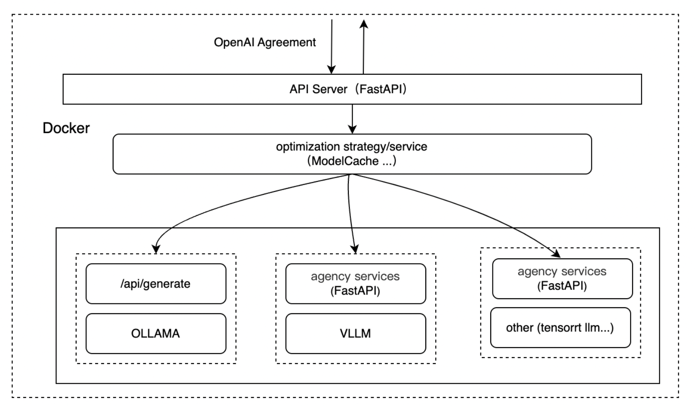

<div align="center">
<h1>
ModelCache
</h1>
</div>

<p align="center">
<div align="center">
<h4 align="center">
    <p>
        <b>中文</b> |
        <a href="">English</a>
    </p>
</h4>
</div>

## Contents
- [news](#news)
- [Introduction](#Introduction)
- [Quick-Deployment](#Quick-Deployment)
- [Service-Access](#Service-Access)
- [Modules](#Modules)
- [Core-Features](#Core-Features)
- [Acknowledgements](#Acknowledgements)
- [Contributing](#Contributing)

### news
- [2024.11.06] EasyDeploy was released, utilizing Docker and Ollama based architecture.

## Introduction
EasyDeploy is engineered to provide users with end-to-end deployment capabilities for large-scale models. By incorporating the deployment and inference logic of large models within Docker, EasyDeploy streamlines the overall deployment process and significantly enhances the user experience. Currently, EasyDeploy supports multiple engines, including Ollama, and plans to extend support to additional engines such as vLLM in the future. 
Through EasyDeploy, users are empowered to rapidly deploy and initiate large-scale models between cloud environments and local devices, effectively eliminating technical barriers and enabling a focus on the application and optimization of the models themselves. Whether operating within local environments or cloud platforms,  EasyDeploy provides efficient and reliable solutions, thereby facilitating the swift advancement and practical implementation of artificial intelligence.

## Quick-Deployment
### Dependencies 
+ Python version: 3.10
+ Package Installation
```shell
pip install -r requirements.txt 
```
### Service Startup
Download Docker Image

Download link：上传后更新

```shell
docker run -p 8000:8000 easydeploy_llama3.2_3b 
```

## Service-Access
The service provides both streaming and blocking access functionalities through RESTful APIs. An example request is presented below:

### Chat Page
[http://127.0.0.1:8000/chat](http://127.0.0.1:8000/chat)

### API Interface
#### Blocking Access
**Request Method**:
```python
# -*- coding: utf-8 -*-
import json
import requests
url = 'http://127.0.0.1:8000/chat/completions'
prompt = '你好'
model = 'lamma3.2'
messages = [{"role": "user", "content": prompt}]
data = {'model': model, 'messages': messages}
headers = {"Content-Type": "application/json"}
response = requests.post(url, headers=headers, data=json.dumps(data))
if response.status_code == 200:
    ans_dict = json.loads(response.text)
    print('data: {}'.format(ans_dict))
```

**Return Format**：

```json
{
    "id": "ollama-123",
    "object": "chat.completion",
    "created": 1731847899,
    "model": "lamma3.2",
    "system_fingerprint": "",
    "choices": [
        {
            "index": 0,
            "message": {
                "role": "assistant",
                "content": "hi! How can I assist you today?"
            },
            "logprobs": null,
            "finish_reason": "stop"
        }
    ],
    "usage": {

    }
}
```

#### **Stream Access**：
**Request Method:**

```python
# -*- coding: utf-8 -*-
import json
import requests
url = 'http://127.0.0.1:8000/chat/completions'
prompt = 'hello'
model = 'lamma3.2'
messages = [{"role": "user", "content": prompt}]
data = {'model': model, 'messages': messages, 'stream': True}
headers = {"Content-Type": "application/json"}
response = requests.post(url, headers=headers, data=json.dumps(data))
```

**Return Format**：
```json
{
  "id": "ollama-123",
  "object": "chat.completion.chunk",
  "created": 1731848401,
  "model": "lamma3.2",
  "system_fingerprint": "",
  "choices": [
    {
      "index": 0,
      "delta": {
        "role": "assistant",
        "content": "hi"
      },
      "logprobs": null,
      "finish_reason": null
    }
  ]
}
```

## Modules

## Core-Features
<table style="width: 100%; border: 1">
    <tr>
        <th style="width: 20%;">Category</th>
        <th style="width: 30%;">Function</th>
        <th style="width: 10%;">Status</th>
        <th style="width: 40%;">Description</th>
    </tr>
    <tr>
        <td rowspan="4">API Service</td>
        <td>OpenAI Standard API</td>
        <td>✅</td>
        <td>The service interface complies with OpenAI standards, minimizing integration costs through standardized APIs. It enables users to seamlessly integrate and maintain the system, swiftly respond to business requirements, and concentrate on core development.</td>
    </tr>
    <tr>
        <td>Blocking access capabilities</td>
        <td>✅</td>
        <td> Suitable for tasks requiring integrity and coherence or for overall verification and processing of results, this approach obtains complete output in a single iteration. Throughout the process, the user must wait until all output content has been fully generated. </td>
    </tr>
    <tr>
        <td>Streaming access capabilities</td>
        <td>✅</td>
        <td>Suitable for real-time applications with stringent response time requirements, such as code completion, real-time translation, or websites with dynamic content loading. The model transmits content incrementally during generation, enabling users to receive and process partial outputs immediately without waiting for full completion, thereby enhancing interactivity.</td>
    </tr>
    <tr>
        <td>High-performance gateway</td>
        <td>⬜</td>
        <td>High-performance gateways effectively manage high-concurrency requests, reduce latency, and enhance response times by optimizing data transmission, employing advanced load balancing algorithms, and implementing efficient resource management.</td>
    </tr>
    <tr>
        <td rowspan="3">Multi-engine Support</td>
        <td>Ollama</td>
        <td>✅</td>
        <td>High-performance gateways effectively manage high-concurrency requests, reduce latency, and enhance response times by optimizing data transmission, employing advanced load balancing algorithms, and implementing efficient resource management.</td>
    </tr>
    <tr>
        <td>vLLM</td>
        <td>✅</td>
        <td>vLLM exhibits significant advantages in memory management and throughput. By optimizing memory usage and parallel computation, it substantially enhances inference speed and resource efficiency, while maintaining compatibility with various hardware environments. vLLM offers a wide range of configuration options, allowing users to adjust inference strategies based on their needs. Its scalable architecture makes it suitable for both research and enterprise-level applications.</td>
    </tr>
    <tr>
        <td>Tensorrt–LLM</td>
        <td>⬜</td>
        <td>TensorRT-LLM (TensorRT for Large Language Models) is a high-performance, scalable deep learning inference optimization library developed by NVIDIA, specifically designed for large language models (LLMs).</td>
    </tr>
    <tr>
        <td>Docker Deployment Capability</td>
        <td>Docker images built with Python 3.10</td>
        <td>✅</td>
        <td>TensorRT-LLM is a high-performance, scalable deep learning inference optimization library developed by NVIDIA, specifically designed for large language models (LLMs).</td>
    </tr>
    <tr>
        <td>Web UI Integration</td>
        <td>OpenUI protocol</td>
        <td>⬜</td>
        <td>The comprehensive UI open-source protocol facilitates users in integrating diverse components, enhancing product customizability and extensibility.</td>
    </tr>
    <tr>
        <td>More Core Features</td>
        <td>ModelCache semantic caching</td>
        <td>⬜</td>
        <td>By caching generated QA pairs, similar requests can achieve millisecond-level responses, enhancing the performance and efficiency of model inference.</td>
    </tr>
</table>


## Acknowledgements
This project draws on the following open-source projects, and we express our gratitude to the relevant projects and researchers for their contributions.  
[Ollama](https://github.com/ollama/ollama)、[vLLM](https://github.com/vllm-project/vllm)

## <font style="color:rgb(31, 35, 40);">Contributing</font>
EasyDeploy is an intriguing and valuable project, which we believe holds significant potential. We welcome contributions from both seasoned developers and novices alike. Contributions may include, but are not limited to, submitting issues and suggestions, participating in code development, and enhancing documentation and examples.

